# WSAP-in-Qualtrics-Modern-Version / Old-Version

This repository contains the instructions and the relevant code snippets for the Word-Sentence Association Paradigm (WSAP) task, to be embedded into Qualtrics.

**Important**: This implementation follows the authentic WSAP methodology described by Beard and Amir (2008; 2009), where participants judge the relatedness between individual words and ambiguous sentences, rather than selecting between interpretations. The task measures interpretation bias through endorsement rates and reaction times for benign vs. threat interpretations.

This is a streamlined version of the [full guide](https://lhw-1.github.io/jsPsych-in-Qualtrics) on creating a jsPsych Experiment to be embedded into Qualtrics (which is not yet up, but the repository can be accessed [here](https://github.com/nus-cts-lab/jsPsych-in-Qualtrics) if you have permission). In order to include the WSAP task into a Qualtrics survey, please follow the steps below!

If you wish to customize your WSAP task (e.g. change the stimuli / fixation cross / durations), refer to the **Advanced Instructions** Section below.

For any questions, please open new issues on this repository - and if you wish to contribute to the documentation / fix any errors, feel free to make a pull request.

Thanks!

~ Hyungwoon ([@lhw-1](https://github.com/lhw-1))

## Embedding Instructions

The WSAP task (or actually, any valid & compatible task written in jsPsych) can be embedded into a Qualtrics survey just like another set of questionnaire.

### Adding the Task as a Question

To begin, create a new block in your survey by clicking **"Add Block"**.

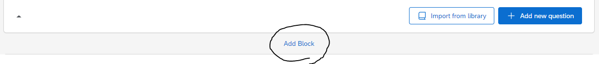

After that, create a new question by clicking **"+ Add new question"**.

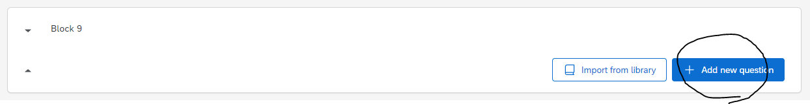

Once you click on the **"+ Add new question"** button, a dropdown will appear. Select the **"Text / Graphic"** option.

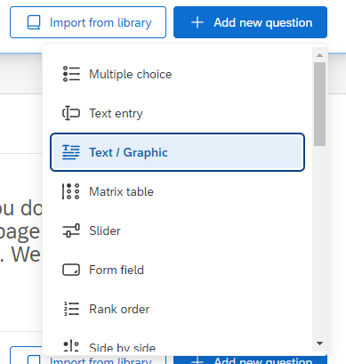

This will result in a template question, as shown below.

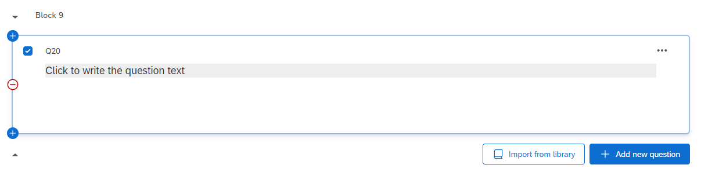

From here, hover above the **"Click to write the question text"**, and click on it. This should show you several more options.

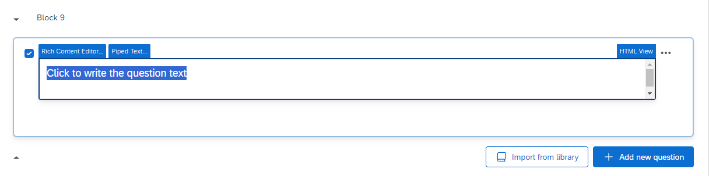

From here, click on **"HTML View"** at the right corner. The following popup will appear.

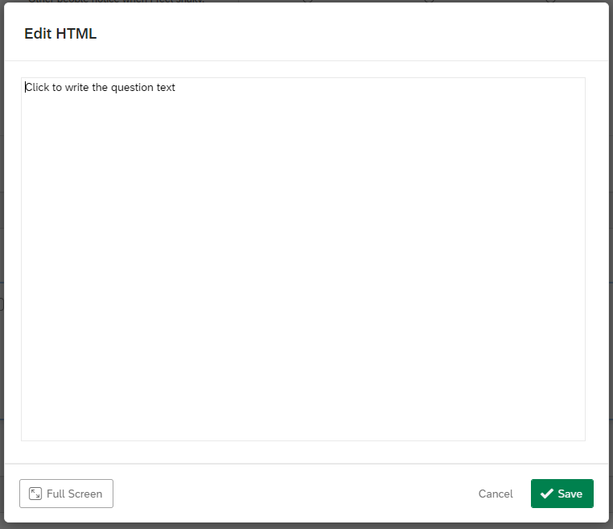

Copy-and-paste the code in `code/index.html` into this box, and then click **"Save"**.

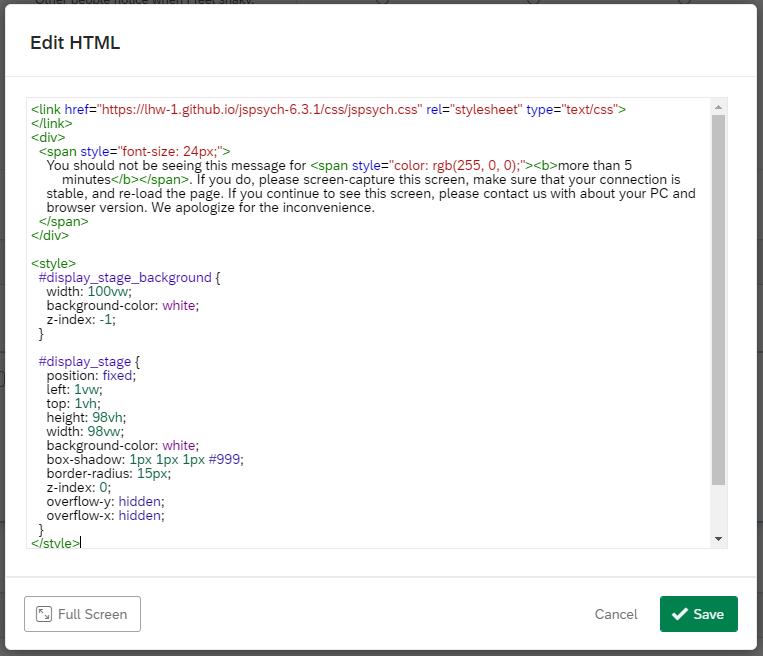

Once you have done so, the question should now look like this.

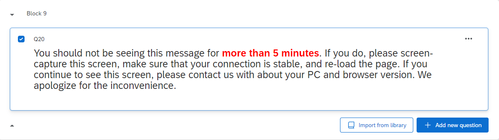

### Adding the WSAP Code

Now, go to the left navigation bar. You should see several options like below (if you do not see them, try clicking on the question once more). Here, click on **"JavaScript"**.

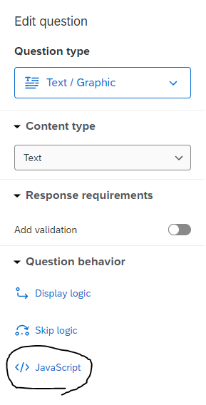

The following popup will appear.

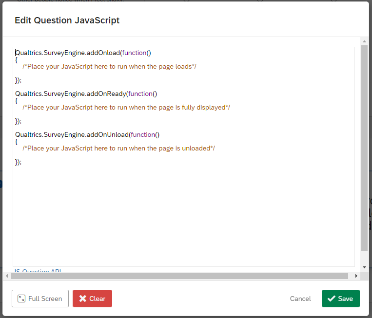

Delete all the code in here, copy-and-paste the code in `code/index.js` into this box, and then click **"Save"**.

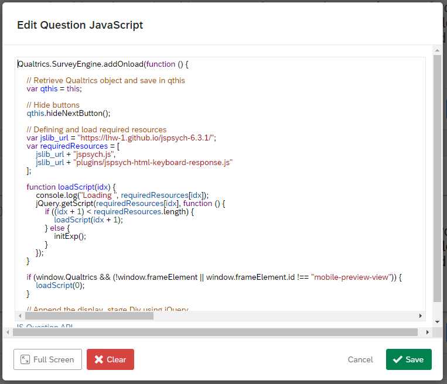

The code has been embedded successfully!

### Adding the Embedded Data

Now, the last thing to tackle is the data recording process. Go to the left navigation bar once more, and this time click on the second icon. This will take you to the **"Survey flow"** page.

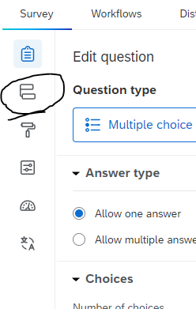

The **"Survey flow"** page should look something like this. This is an example taken from a pre-existing survey; the question names were crossed out for privacy purposes.

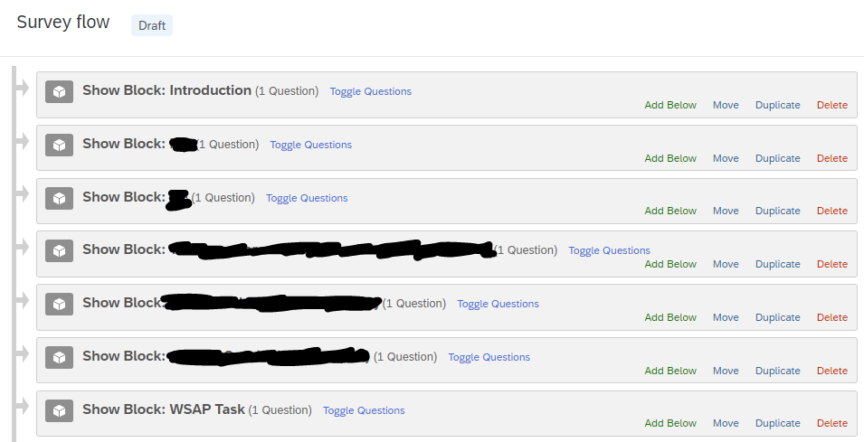

Here, there should be a block for your WSAP task (or whatever it is named). On the block containing your WSAP task, click on **"Add Below"**.

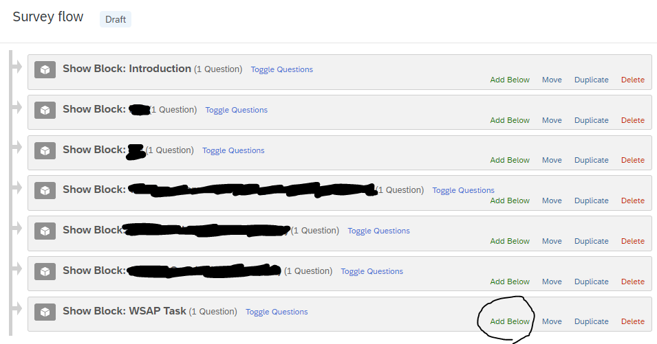

This will popup.

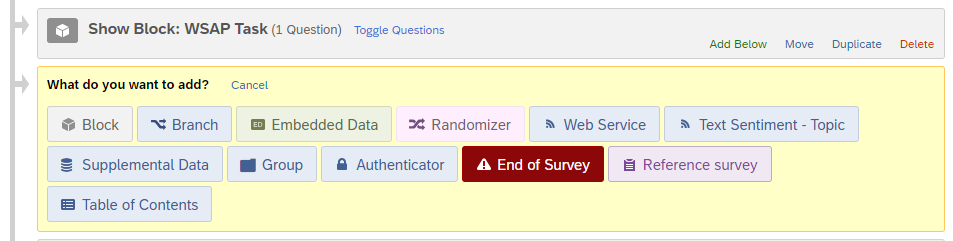

Here, click on **"Embedded Data"**.


This will be the result of clicking on **"Embedded Data"**.

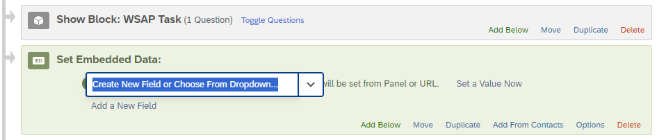

Here, what you need to do is to create 4 separate data entries named:

- `stimulus`
- `response`
- `reaction_time`
- `valence`

When you do this, Qualtrics will automatically log these data, and it will be accessible through its `.csv` data file export. After you have included all 4, it should look like this.

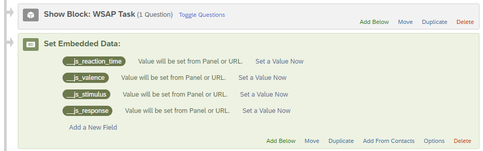

Remember to click on **"Apply"** at the bottom of the page.

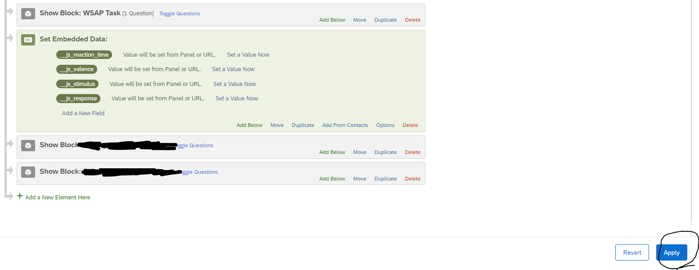

And you're all set! Head back to the survey tab, and publish the survey.

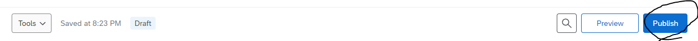

## Advanced Instructions

The code for the WSAP task is contained inside `code/index.js` file.

### Understanding the WSAP Paradigm

This implementation follows the authentic Word-Sentence Association Paradigm (WSAP) described by Beard and Amir (2008; 2009). Each trial consists of four steps:

1. **Fixation cross** (500ms) - Alerts participant that trial is starting
2. **Word presentation** (500ms) - Single word appears (benign or threat interpretation)
3. **Sentence presentation** - Ambiguous sentence appears, participant presses spacebar when finished reading
4. **Relatedness judgment** - Participant judges if the word and sentence are related (F=related, J=unrelated)

The task measures interpretation bias through endorsement rates and reaction times for benign vs. threat interpretations.

### Customizing Stimuli

To change the stimuli, look for the section with the following comments:

```js
// Base scenarios for creating word-sentence pairs
var base_practice_scenarios = [
  ...
];

var base_scenarios = [
  ...
];
```

Each scenario is defined as follows:

```js
{ stimulus: "You hear a noise in the night.", words: ["Dog", "Robbery"], labels: ["benign", "anxiety"] },
```

The code automatically creates word-sentence pairs from these base scenarios. For each scenario:

- **stimulus**: The ambiguous sentence (no blanks needed)
- **words**: Array with [benign_word, threat_word]
- **labels**: Array with [word_type, scenario_category]

This will generate 2 trials per scenario (one for each word), creating 54 total trials from 27 base scenarios.

### Trial Structure

- **Practice**: 4 trials (2 scenarios × 2 words each)
- **Main Task**: 54 trials (27 scenarios × 2 words each)
- **Duration**: Approximately 6-8 minutes

### Customizing Instructions

To modify the task instructions, find the `welcome` and `briefing` variables in the code. You may find that having some **basic knowledge of HTML, CSS, and JavaScript** will be helpful when modifying the instruction text.
