# WSAP-in-Qualtrics

This repository contains the instructions and the relevant code snippets for the Word-Sentence Association Paradigm (WSAP) task, to be embedded into Qualtrics.

This is a streamlined version of the [full guide](https://lhw-1.github.io/jsPsych-in-Qualtrics) on creating a jsPsych Experiment to be embedded into Qualtrics (which is not yet up, but the repository can be accessed [here](https://github.com/nus-cts-lab/jsPsych-in-Qualtrics) if you have permission). In order to include the WSAP task into a Qualtrics survey, please follow the steps below!

If you wish to customize your WSAP task (e.g. change the stimuli / fixation cross / durations), refer to the **Advanced Instructions** Section below.

For any questions, please open new issues on this repository - and if you wish to contribute to the documentation / fix any errors, feel free to make a pull request. 

Thanks!


~ Hyungwoon (@lhw-1)

## Embedding Instructions

The WSAP task (or actually, any valid & compatible task written in jsPsych) can be embedded into a Qualtrics survey just like another set of questionnaire. 

### Adding the Task as a Question

To begin, create a new block in your survey by clicking **"Add Block"**.

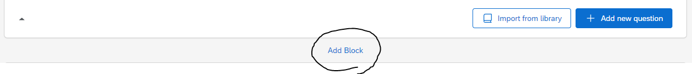

After that, create a new question by clicking **"+ Add new question"**.

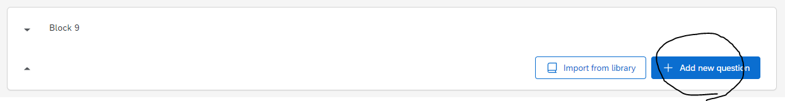

Once you click on the **"+ Add new question"** button, a dropdown will appear. Select the **"Text / Graphic"** option.

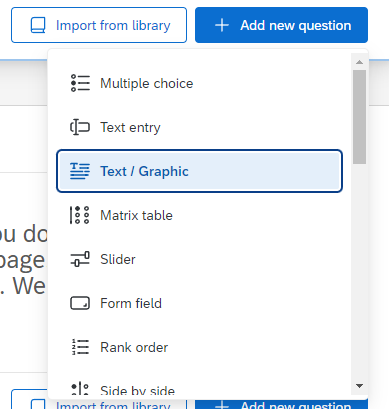

This will result in a template question, as shown below.

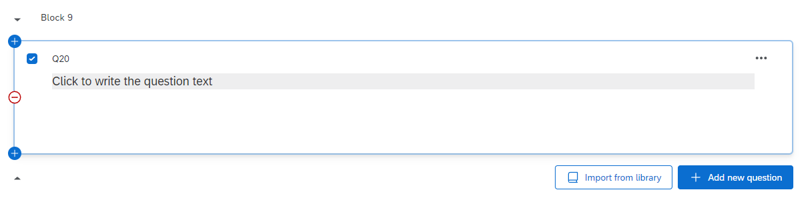

From here, hover above the **"Click to write the question text"**, and click on it. This should show you several more options.

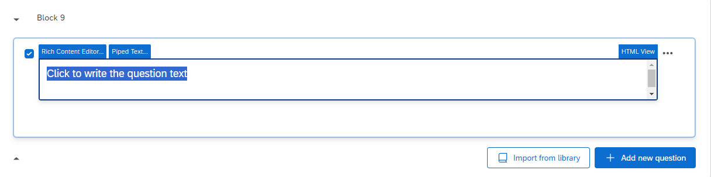

From here, click on **"HTML View"** at the right corner. The following popup will appear.

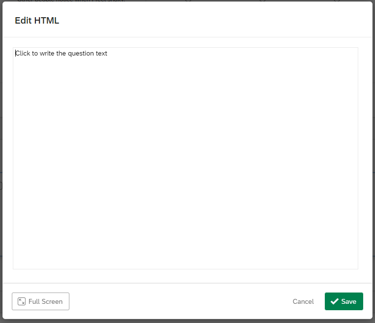

Copy-and-paste the code in `code/index.html` into this box, and then click **"Save"**.

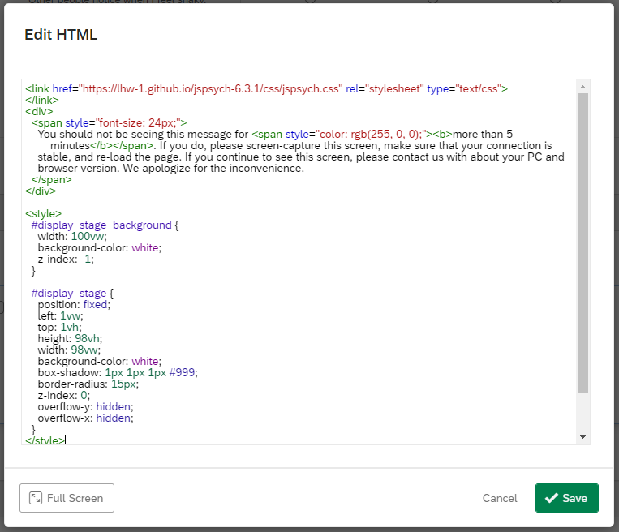

Once you have done so, the question should now look like this.

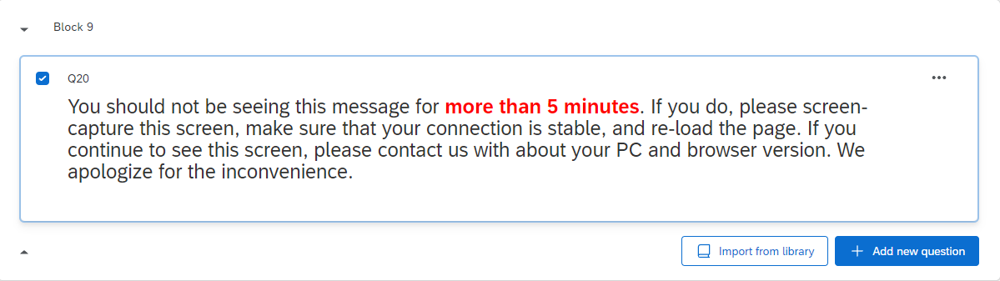

### Adding the WSAP Code

Now, go to the left navigation bar. You should see several options like below (if you do not see them, try clicking on the question once more). Here, click on **"JavaScript"**.

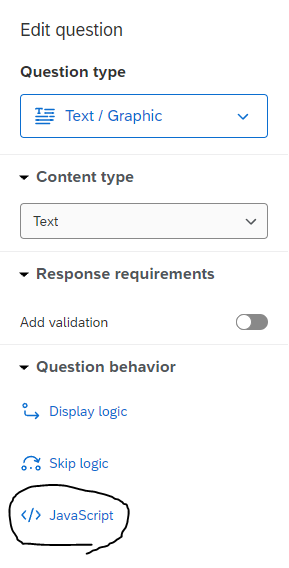

The following popup will appear.

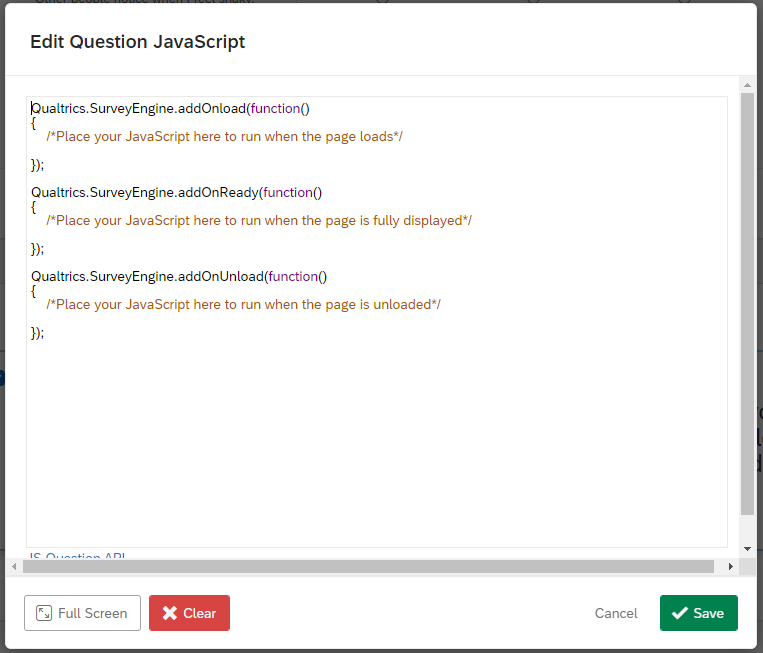

Copy-and-paste the code in `code/index.js` into this box, and then click **"Save"**.

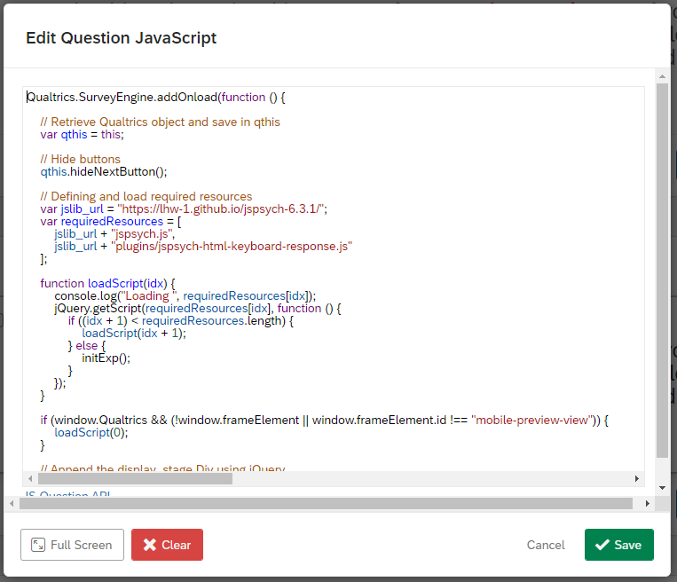

The code has been embedded successfully! 

### Adding the Embedded Data

Now, the last thing to tackle is the data recording process. Go to the left navigation bar once more, and this time click on the second icon. This will take you to the **"Survey flow"** page.

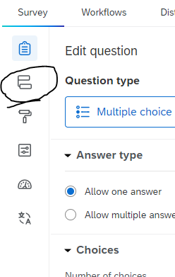

The **"Survey flow"** page should look something like this. This is an example taken from a pre-existing survey; the question names were crossed out for privacy purposes.

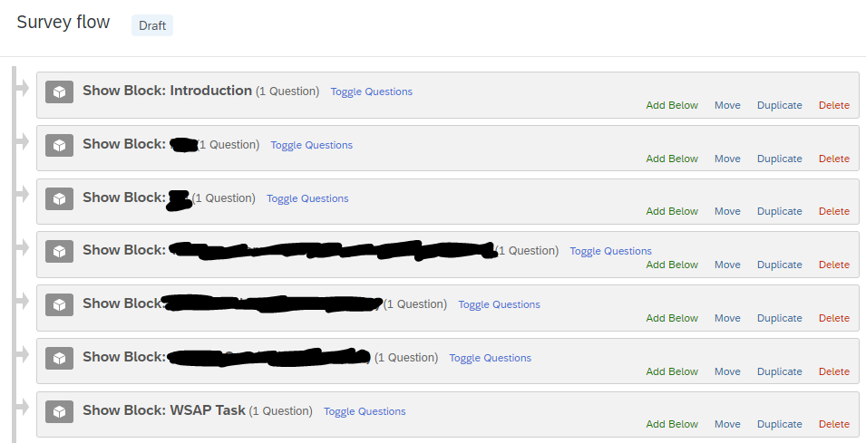

Here, there should be a block for your WSAP task (or whatever it is named). On the block containing your WSAP task, click on **"Add Below"**.

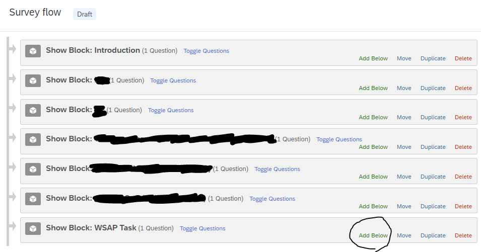

This will popup.

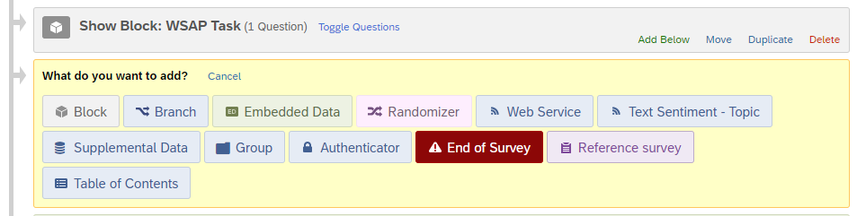

Here, click on **"Embedded Data"**.


This will be the result of clicking on **"Embedded Data"**.

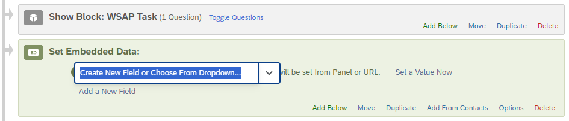

Here, what you need to do is to create 4 separate data entries named:

* `__js_reaction_time`
* `__js_valence`
* `__js_stimulus`
* `__js_response`

(Note: It is two underscores followed by "js", and then one more underscore, and then the names.)

When you do this, Qualtrics will automatically log these data, and it will be accessible throughits `.csv` data file export. After you have included all 4, it should look like this.

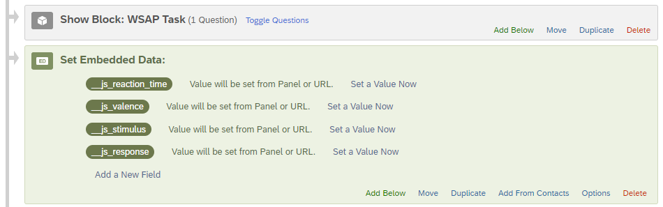

Remember to click on **"Apply"** at the bottom of the page.

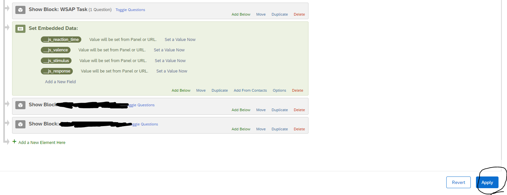

And you're all set! Head back to the survey tab, and publish the survey.

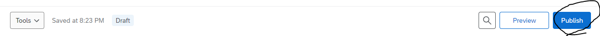

## Advanced Instructions

The code for the WSAP task is contained inside `code/index.js` file.

The most common advanced use case might be to change the stimuli. To do this, go into the code, and look for the section with the following comments:

```js
// Practice Scenarios for the experiment
var practice_stimuli = [
  ...
];
shuffleArray(practice_stimuli);

// Scenarios for the experiment
var stimuli = [
  ...
];
shuffleArray(stimuli);
```

This should be at Line 52 onwards, if using the file directly provided in this repository.

Here, you may notice that each of the stimuli are defined as follows:

```js
{ stimulus: "You have made an appointment to see your doctor to discuss your test results. You think the results will probably show you are _____.", words: ["fine", "ill"], labels: ["benign", "health-threat"] },
```

Follow the format, and add in any new stimuli / replace the old stimuli as needed for your task. The two labels will correspond to the words provided (e.g. in the example above, "benign" corresponds to "fine", and "health-threat" corresponds to "ill").

Another use case may be to change the wording of the instructions. In this case, you may scroll down to find the sections that contain the instruction wordings, and change them accordingly. You may find that having some **basic knowledge of HTML, CSS, and JavaScript** might be helpful to ensure that no errors occur when changing the strings directly, though.
